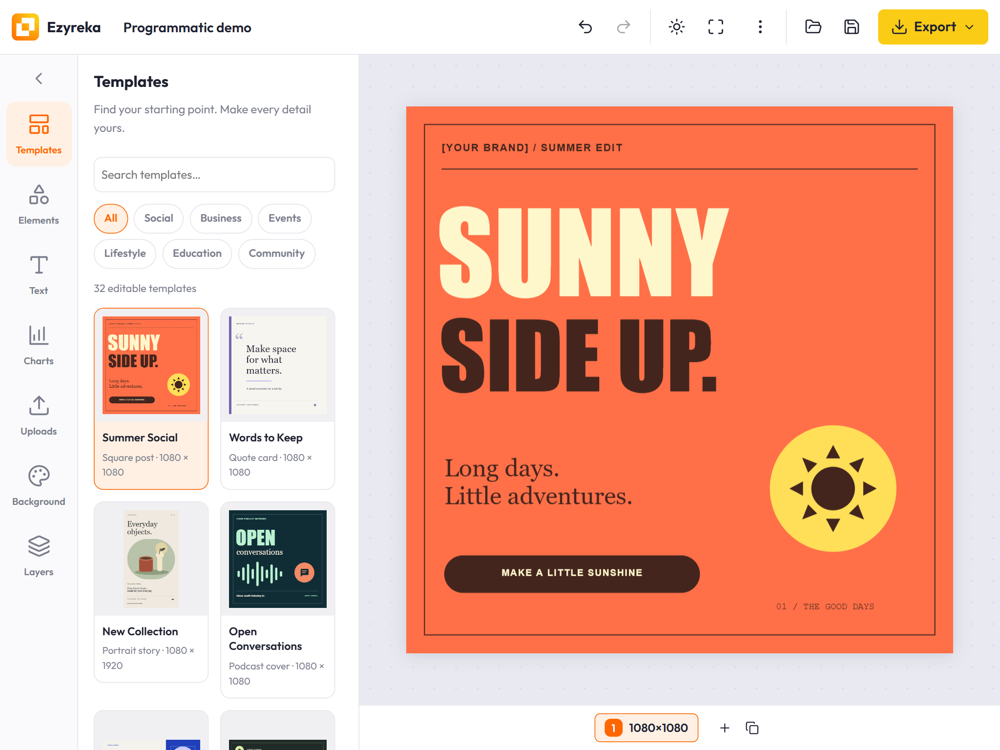

# Ezyreka

[](https://opensource.org/licenses/MIT)
[](https://github.com/bookklik-technologies/ezyreka)

Embeddable, dependency-free JavaScript library for adding a Canva-style design
editor to web apps by [Bookklik Technologies](https://github.com/bookklik-technologies).
Ships as a single JS bundle and runs with the built-in UI or as a headless
canvas engine, initialized **programmatically** with JavaScript or
**declaratively** via `<div data-ezr-editor></div>`.

No frameworks. No runtime dependencies. One script tag.



## Features

- Canvas engine with a DOM overlay for handles and guides
- Elements: text, images, shapes, lines and icons with full transform, snapping and inline text editing
- Editable charts (data + style), multi-page documents, 32 editable templates
- Layers panel, undo/redo, copy/paste, zoom & pan, context menu, keyboard shortcuts
- PNG/JPEG/JSON export, themes, headless mode, customizable UI
- Extensible: custom element types, renderers, chart types, sidebar panels and **community plugins**

## Documentation

Full guides and API reference: <https://bookklik-technologies.github.io/ezyreka/>

## Quick start

### Declarative (browser bundle)

```html
<div
  id="app"
  data-ezr-editor
  data-ezr-width="1080"
  data-ezr-height="1080"
  data-ezr-name="My design"
></div>
<script src="https://unpkg.com/@bookklik/ezyreka/dist/ezyreka.umd.js"></script>
```

Size the container with CSS (e.g. `#app { width: 100vw; height: 100vh; }`).

### npm / ESM

```bash
npm install @bookklik/ezyreka
```

```js
import { Editor } from '@bookklik/ezyreka';
```

### Programmatic

```js
const { Editor } = Ezyreka; // UMD global

const editor = new Editor({
  target: '#app',          // selector or HTMLElement
  width: 1080,             // page width in px
  height: 1080,            // page height in px
  name: 'Untitled design'  // file name
});

editor.on('ready', () => {
  editor.addText({ text: 'Hello Ezyreka', fontSize: 96, fontWeight: 800 });
  editor.addElement({ type: 'rect', x: 340, y: 620, w: 400, h: 110, radius: 55 });
});
```

## Examples

Plain HTML, React and Vue integrations in the [examples folder](examples/README.md)
— or run the dev server (`npm run dev` → `http://localhost:8080/examples/`).

## Development

```bash
npm install
npm run build   # build dist/ (ESM + UMD, minified)
npm run dev     # watch + dev server at http://localhost:8080/examples/
npm test        # unit + DOM tests (node + jsdom)
npm run docs:dev  # documentation dev server
```

## Status

Runs in modern evergreen browsers (Chrome, Edge, Firefox, Safari) using HTML5
canvas 2D, `Path2D`, `ResizeObserver`, `contenteditable` and pointer events.

## License

MIT
